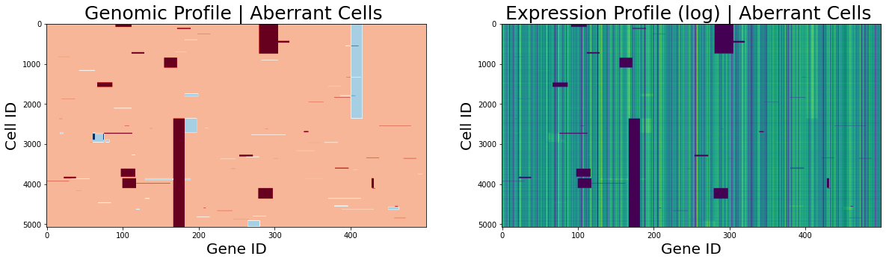
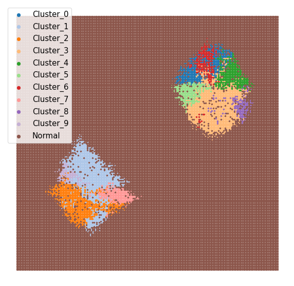

# Description
This repository contains the code for a generative process that, with several
important intermediary steps, will generate _in silico_ spatial
transcriptomics data **with associated - spatially aware - clonal (genomic) information**. In short, the
process can be described as:

1. Define a tissue domain (which cell will populate)
2.  Initialize the tissue with seeding cancer cells (these will have an amplification or deletion event)
3.  Grow the tissue (during this process, cells multiply and mutation events can occur)
4.  Add "normal" cells to regions that cancer cells do not populate
5. Place a grid of spots over the tissue
6. Identify which cells that overlay respective spot in the grid
7. Sample gene expression from cells (this is dependent on both the standard
   expression levels and the number of copies of each cell), and "capture" a
   fraction of these transcripts at the associated spot
  
Below, the model is described in more detail:

# Model
The model itself consists of two main components: the genome and the cell. Each
cell has a genome which dictates its expression profile, and each cell can also
perform certain actions. Once these two components are defined, we can apply a
set of functions to generate the _in silico_ data. Below, these components and
actions are described in a sequential manner.

## Genome
We will define the initial genome structure, that will the basis for every cells
individual genome. For the sake of simplicity, we our genome will consists of a
single chromosome with no introns. The genome has certain attributes associated with it:

- length : the total length (in base pairs) of the genome
- genes : elements in the genome, each gene has a
  - start position : where in the genome the gene starts
  - end position : where in the genome the gene ends
  - expression tendency : this is referred to as $theta$-value, and determines
    the expression level of each gene.

The genes have different sizes, and their lengths are randomly initialized such
that their average length is `n_genes / genome_length`.

### Amplification and deletion events
The Genome has two actions associated with it: _deletion_ and _addition_. Both
these events occur in a similar fashion (even though the results are quite the
opposite). When either of the actions is called, we will sample a random
position on the genome which will figure as the center of the event, and then
determine the width of the event, the latter is sampled from a truncated
normal(at zero) with zero mean and the variable `event_spread` set as the
standard deviation value. The genes that are deleted/amplified are all genes
encompassed in the region `[center - width,center+width]`. This means that we
will see co-amplification/deletion of genes, if they reside near each other on
the genome.


### Expression
We will model gene expression by a Dirichlet-Multinomial process defined as follows:


Where _x_<sub>c</sub> is the expression vector for cell _c_ and _n_<sub>cg</sub> is
the number of copies of gene _g_ that cell _c_ has. _N_<sub>c</sub> is the number of
transcripts to sample from the specific cell.

This means that the propensity to express a certain gene is partially dependent
on its baseline level (`theta`) but also eventual changes to the genome.


## Cell

Each cell will have a genome (as described above associated with it), in a
population of cells all inhabiting the same domain (tissue), the genome of all
cells will originate from the same initial genome (meaning they all have the
same `theta` values), but they might have picked up individual changes along the
course of time (e.g., amplification and deletion events.) which means that their
_n_<sub>cg</sub> values and hence `theta_hat` values differ.

Every cell object has four main actions that it can perform:

- die : if a cell dies it is removed from the population.
- move : a cell can move either one or two steps at each life cycle. The
  propensity to move in a certain direction varies between each individual cell.
  A cell can only move to a free location, if no free space is found in the
  neighborhood it will remain stagnant.
- spawn : a cell can also spawn offspring, a copy of itself with the exception
  of _eventual_ mutations to the genome. Just as for the move, a cell can only
  spawn offspring to a free space in its neighborhood, if no free space is
  available the cell will not spawn. Find more on mutations below.
- rest : a cell that rests remains in place.

The tendency for each of these actions to occur is specified with a sate of
`action_rates`, which should all sum to 1. Meaning that when we
call for a cell to perform an action, we will do by: `action ~
Categorical(p_die,p_move,p_spawn,p_rest)`. Modifying this will have a
significant impact on the population's character.


### Mutations
Mutations in the genome might occur, to the daughter cell, when a cell is
spawning. Mutations do not occur during any of the other actions. When mutating
it's a 1:1 chance of an deletion vs amplification to occur. Either type of
mutation (deletion/amplification) will invoke the above described process for
the Genome object that the particular cell hosts. The tendency to mutate during
a spawning action is determined by a `mutation_rate` similar to the above
described `action_rates`

### Cell states
To mimic the "patchy" structure of cancer clones in spatial data, we actually
need to introduce some more dynamic behavior in our population. Thus, rather
than letting the cell behave the same at all times, we introduce the idea of
having two different _states_. One state (`state 0`) where the cells mainly move
and spawn, but with basically no mutation (low `mutation_rate`), this allows
certain clones to expand and populate the tissue domain. The second state
(`state 1`) the cells are less prone to be resting, but when they spawn they
have a much higher `mutation_rate`, this allows new clones to be introduced into
the population but also for the already existing ones to spread to a certain
extent. This dynamic behavior can easily be represented by a two state Markov model.


The probabilities _p_<sub>ij</sub> describes how likely we are to go **from** state
_i_ **to** state _j_, these are referred to as `transition_probabilities`. The
state is inherited by a daughter cell from its parent cell, we also make sure
that the daughter and parent cell sync in their states, until the next change of
states. Meaning they will both change state at the same time, but then become
desynchronized, this is to prevent prolific introduction of mutations into the tissue.


### Lineage Tracing
Every cell will keep track of which cell that was it's parent, meaning that
lineage tracing is easily conducted. 


## Tissue Growth

Having defined how Cells and the Genome behaves, we can continue with to
actually construct our tissue _in silico_. The process is an iterative one,
which can be described as:

1. Place _N_<sub>0</sub> initial cells in the tissue domain. We will also
   immediately introduce an abberation into the genome of these cells, this can
   be either a deletion or amplification of desired size. By doing this, we are
   guaranteed to have _N_<sub>0</sub> distinctly different clonal populations in
   our tissue. These _N_<sub>0</sub> initial cells are added to our `population`
   of cells.

2. For every cell in the `population` call for an action to occur.
3. Repeat (2) until more than `max_cells` cells are present in the population or
   `max_iterations` iterations have been executed.
4. Fill in all of the empty space in the tissue domain with normal cells,
   sharing the same initial genome as the aberrant cells, but with no mutations.

This will generate a tissue akin to the one below, where each pixel represents
and individual cell and the color indicates the total number of aberrations in
the genome. In the example below we set _N_<sub>0</sub> to 2.


We can also look at the genomic profile and what a sample of the expression
profile from these cells would look like. The images below represent these
features (genomic and expression profile) for the subset of aberrant cells.




### Clustering 

As we often are more interested in groups of cells than perhaps the individual
cell itself, this implementation also implements an agglomerative clustering
step - based on the genomic profile of each cell - which shows how these
clusters share a clear spatial zonation pattern:



Since we have all of the lineages traced, we can relate these clusters to each
other, and build a form of lineage tree (here represented as a graph). The root
nodes are colored in lightblue, and arrows go from parent to child.


As we can see this shows that we have two different lineage trees here, expected
since we started with 2 cells with different aberrations. We also see how this
checks out with the spatial arrangement of the clusters, for example: cluster
1,2,7 and 9 are all located in the tumor in the bottom left corner and are also
found in the same tree in our cluster lineage.

## _in silico_ spatial transcriptomics

Now once the tissue has been artificially grown, all that remains to be done is
to perform the actual spatial transcriptomics experiment, and generate
artificial spatial data.


### Creating an array

The first thing we will do is to construct a grid that represents the spots in
our array, and place this grid over our tissue. The spots will have a certain
`spot_radius` and all cells that are within `spot_radius` distance from a spot
center will be considered as belonging to that given spot, obviously cells can
only belong to one spot. Just like in the real spatial transcriptomics
experiments, some cells do not belong to any spots (i.e., we will not capture
transcripts from them). Below is an image of the spots overlaid on the tissue
(left) and only the grids with each spot colored by the number of cells that are
assigned to each spot (right).


Looking at the scalebars we see that the variance in cells is very low, the
smallest value is 16 and the largest is 21.

### Capturing transcripts

The next step is to capture transcripts at each of our spots, to do this we
stimulate the cells to express genes (like above), collect all the transcripts
from all the cells residing at a spot and then from this collective mass
subsample _N_<sub>s</sub> transcripts using the multinomial distribution, where
we let the probabilities be proportional to the number of transcripts from
respective gene. Meaning we end up with data similar to real spatial
transcriptomics data. The image below illustrates what the expression of a
certain gene looks like in this _in silico_ spatial transcriptomics experiment.


# Use
The process described above is all packaged into a easy-to-use CLI application
than can be run from the terminal. Since the model relies on several parameters,
rather than providing these as input flags, we will use a design file (`toml`
format). Where all these parameters are defined, and all we need to do is to
provide a path to the design file we want to be used in the modelling. The data
presented above, was generated from the following design file:

```toml
[genome]

n_genes = 500 # number of genes to use
genome_size = 1e5 # size of genome
event_spread = 10 # influences size of events (amplification/deletion)
concentration = 1 # influences how homogenous the expression tendencies are, recommend to use 1
initial_event_size = 15 # size of initial event in the seeding cells


[population]
n_initial_cells = 2 # number of intitial cells (N_0)
domain_side_size = 200 # size of spatial domain (square with these sides will be used)
fraction_drop = 0.05 # fraction of tumor cells to "kill" after growth
n_clusters = 10 # number of clusters to use
max_cells = 5e3 # upper threshold for the number of cells in the tissue, growth terminates once above

    [population.transitions]
    s0s1 = 0.2 # probability of going from state 0 to state 1 (p_01)
    s1s0 = 0.2 # probability of going from state 1 to state 0 (p_10)
    [population.rates_state_0] # action rates pertaining to state 0
    move_rate = 0.4  
    stay_rate = 0.1
    spawn_rate = 0.4
    death_rate  = 0
    mutation_rate = 0.0
    [population.rates_state_1] # action rates pertaining to state 1
    move_rate = 0.3
    stay_rate = 0.45
    spawn_rate = 0.2
    death_rate  = 0
    mutation_rate = 0.8

    # initial coordinates for the seeding cells, specify one tuple for each cell, or none (then random sampling occurs)
    [[population.initial_coordinates]]
    x = 50
    y = 50

    [[population.initial_coordinates]]
    x = 150
    y = 150


[spatial]
depth = 5000 # depth of sampling from transcript pool at each spot
n_spots_x = 20 # number of columns (spot)
n_spots_y = 20 # number of rows (spots)
spot_radius = 2.5 # radius of spot
```

This file, without the comments, can be found in the `config` folder.

Once you've specified the design file, simply do `python3 ./main -d design.toml -o OUT_DIR`, where `OUT_DIR` is the directory you wish to output the data into. If you add the flag `-vo` you will also get some visual output to easily inspect what your tissue looks like.

The output from `growmeatissue` will be the following files:
```sh
.
├── cluster_lineage.tsv # cluster match matrix
├── genome.tsv # genome information
├── lineage.tsv # child,parent table for every cell
├── single_cell_data
│   ├── sc-expression.tsv # single cell expression matrix
│   ├── sc-genome_profile.tsv # genome profile matrix
│   └── sc-meta_data.tsv # meta data for individual cells
├── spatial_data
│   ├── cell_by_spot.txt # which cells that reside at each spot
│   ├── cluster_data.tsv # proportion of cells at each spot that belong to respective cluster
│   ├── st-annotation.tsv # annotation of each spot as benign or aberrant
│   ├── st-expression.tsv # spatial gene expression data
│   ├── st-genome_profile.tsv # spatial genomic profiles (average at each spot)
│   └── st-meta.tsv # meta data for spatial data
└── visual
    ├── tissue.png # image of the tissue
    └── tissue_w_array.png # image of the tissue with array overlaid
```

# Requirements


